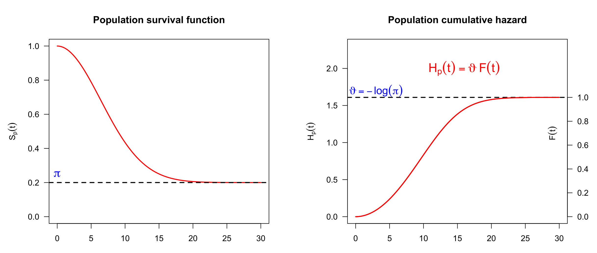

```{r setup, include=FALSE}
knitr::opts_chunk$set(echo = TRUE)
knitr::opts_chunk$set(fig.path="man/figures/")
```

## Introduction
The _*tvcure*_ package enables to fit additive cure survival model with exogenous time-varying covariates (Lambert \& Kreyenfeld, 2025) [1,2].

The starting point is the bounded cumulative hazard model (also name the *promotion time* model) (Tsodikov 1998) with population survival function
$$S_p(t|\mathbf{v}) = \exp\{-H_p(t|\mathbf{v})\} =\exp\{-{\vartheta(\mathbf{v})} F(t)\},$$ 
bounded hazard $H_p(t|\mathbf{v})$ and cure fraction $\pi(\mathbf{v})=S_p(+\infty|\mathbf{v})=\exp\{-{\vartheta(\mathbf{v})}\}$, see Figure 1.
Function $F(t)$ is a c.d.f. governing the population hazard dynamics, with $F(0)=1$ and $F(T)=1$ where $T$ is the minimum value of time after which an event-free unit is considered cured.
<figure>

<figcaption>
Fig.1: Bounded cumulative hazard model with cure probability $\pi$.
</figcaption>
</figure>

The extended promotion model (Bremhorst and Lambert 2016) additionally allows the event dynamics governed by $F(t)$ to change with covariates $\tilde{\mathbf{v}}$,
$$S_p(t|\mathbf{v},\tilde{\mathbf{v}}) = \exp\{-H_p(t|\mathbf{v},\tilde{\mathbf{v}})\} =\exp\{-{\vartheta(\mathbf{v})} {F(t|\tilde{\mathbf{v}})}\}$$

For categorical covariates ${\mathbf z}$ and continuous covariates ${\mathbf x}$, the following additive long-term survival submodel defining the cure probability is assumed,
$\vartheta(\mathbf{v})= -\log \pi(\mathbf{v}) =\exp\{\eta_\vartheta(\mathbf{v})\}$
where
$\eta_\vartheta(\mathbf{v}) = \beta_0 + {\pmb \beta}^\top{\mathbf z} + \sum_j f_j(x_j)$,
a positive value for $\beta_k$ suggesting an event probability increasing with $z_k$ and, consequently, a cure probability decreasing with $z_k$.
The event dynamics is governed by the additive short-term submodel,
$F(t|\tilde{\mathbf{v}}) = 1-S_0(t)^{\exp(\eta_F(\tilde{\mathbf{v}}))}$,
where $\eta_F(\tilde{\mathbf{v}})= {\pmb{\gamma}}^\top\tilde{\mathbf{z}} + \sum_j \tilde{f}_j(\tilde{x}_j)$,
a positive value for $\gamma_k$ suggesting an acceleration of event timing with $z_k$,  see Bremhorst, Kreyenfeld \& Lambert (2019). The baseline density function $f_0(t)=-{d\over dt}S_0(t)$ and the additive terms are specified using Bayesian P-splines. The model is identifiable provided that the follow-up is sufficiently long to display the plateau in the population survival function (Lambert \& Bremhorst, 2019).

The core contribution in Lambert and Kreyenfeld (2025) is an extension of that model to include exogenous time-varying covariates.
The model specification starts with the population hazard function from which other quantities can be obtained:
 $$h_p(t|\mathbf{v}(t),\tilde{\mathbf{v}}(t)) = \vartheta(\mathbf{v}(t)) f(t|\tilde{\mathbf{v}}(t)) = \mathrm{e}^{\eta_\vartheta(\mathbf{v}(t))+\eta_F(\tilde{\mathbf{v}}(t))} f_0(t)S_0(t)^{\exp(\eta_F(\tilde{\mathbf{v}}(t))-1}$$ 
In the special case where covariates are constant, we return to the preceding extended promotion time model with static covariates.

The combination of **Laplace approximations** and of **Bayesian P-splines** (named *LPS*) enable fast and flexible inference in a Bayesian framework (Lambert \& Gressani, 2023). The Gaussian Markov field prior assumed for the penalized spline parameters and the Bernstein-von Mises theorem provide reliable Laplace approximation to the posterior distribution of these quantities.

## The *tvcure* package in action

Let us illustrate the use of the *tvcure* package on simulated right-censored data:

```{r tvcure0}
## Package installation and loading
## install.packages("devtools")
## devtools::install_github("plambertULiege/tvcure")
library(tvcure) 
	
## Data simulation
beta = c(beta0=.4, beta1=-.2, beta2=.15) ; gam = c(gam1=.2, gam2=.2)
data = simulateTVcureData(n=500, seed=123, beta=beta, gam=gam,
                        RC.dist="exponential",mu.cens=550)$rawdata
round(head(data),3)
```

The data frame should always have a counting process form and contain at least the following entries:

* id: the ⁠id of the unit associated to the data in a given line in the data frame.

* time: ⁠ ⁠the integer time at which the observations are reported. For a given unit, it should be a sequence of **consecutive** integers starting at 1 for the first observation. 

* event : ⁠ ⁠a sequence of 0-1 event indicators. For the lines corresponding to a given unit, it starts with 0 values concluded by a 0 in case of right-censoring or by a 1 if the event is observed at the end of the follow-up.


### Model fitting
Let us fit a double additive tvcure model to these data with:

* categorical covariates $z_1, z_2$ and continous covariates $x_1$ and $x_2$ entering in an additive way in the long-term survival submodel ;

* categorical covariates $z_3, z_4$ and continous covariates $x_3$ and $x_4$ entering in an additive way in the short-term survival submodel.

```{r tvcure1a}
model = tvcure(~z1+z2+s(x1)+s(x2),
               ~z3+z4+s(x3)+s(x4), data=data)
print(model)
```

The estimated reference hazard $\mathrm{e}^{\beta_0}f_0(t)$ and the associated c.d.f. function $F_0(t)$ governing the baseline dynamics of the cumulative hazard can also visualized,
```{r tvcure1b1, fig.width = 10, fig.align = "center"}
plot(model, select=0, pages=1)
```
as well as the estimated additive terms in the long-term survival submodel,
```{r tvcure1b2, fig.width = 10, fig.align = "center"}
plot(model, select=c(1,2), pages=1) ## First 2 additive terms in the model
```
or in the short-term survival submodel,
```{r tvcure1b3, fig.width = 10, fig.align = "center"}
plot(model, select=c(3,4), pages=1) ## Last 2 additive terms in the model
```

It is possible to force the additive terms to be zero for selected reference values for the covariates, which facilitates the interpretation of the other model parameters:
```{r tvcure1c}
model = tvcure(~z1+z2+s(x1,ref=.75)+s(x2,ref=.5), 
               ~z3+z4+s(x3,ref=.75)+s(x4,ref=.5), data=data)
plot(model, select=1:4, pages=1) ## The 4 additive terms in the model
```

### Predictions
Predictions can be made for a given history of covariate values. Consider for example unit 1 for which no event was observed by the end of the follow-up:
```{r tvcure2a}
data1 = subset(data, data$id==1) ## Data for unit 1
round(tail(data1, n=1),3) ## Data at the last observation time
```
The estimated population survival function of a subject sharing the same covariate history can be computed and visualized,
```{r tvcure2b}
obj = predict(model, ci.level=0.95, newdata=data1)
matplot(obj$Sp, ylim=c(0,1),
        type="l", lty=c(1,2,2), col=1, las=1,
        xlab="time", ylab=bquote(S[p](t)))
grid(lwd=.5,lty=1)
```

with the last value providing the estimated cure probability (with credible bounds):
```{r tvcure2c}
print(tail(obj$Sp,n=1)) ## Cure probability
```

More details can be found in Lambert \& Kreyenfeld (2025) and in the documentation of the *tvcure* package.

## License
**tvcure**: Additive cure survival model with exogenous time-varying covariates. Copyright (C) 2023-2025 Philippe Lambert

This program is free software: you can redistribute it and/or modify it under the terms of the GNU General Public License as published by the Free Software Foundation, either version 3 of the License, or (at your option) any later version.

This program is distributed in the hope that it will be useful, but WITHOUT ANY WARRANTY; without even the implied warranty of MERCHANTABILITY or FITNESS FOR A PARTICULAR PURPOSE. See the GNU General Public License for more details.

You should have received a copy of the GNU General Public License along with this program. If not, see https://www.gnu.org/licenses/.

## References
[1] Lambert, P. and Kreyenfeld, M. (2025). Time-varying exogenous covariates with frequently changing values in double additive cure survival model: an application to fertility. Journal of the Royal Statistical Society, Series A. [*doi:10.1093/jrsssa/qnaf035*](https://doi.org/10.1093/jrsssa/qnaf035)

[2] Lambert, P. (2025). R-package *tvcure* - Version `r packageVersion("tvcure")`. GitHub: [plambertULiege/tvcure](https://github.com/plambertULiege/tvcure)

### Complementary references
[3] Lambert, P. and Gressani, O. (2023). Penalty parameter selection and asymmetry corrections to Laplace approximations in Bayesian P-splines models. Statistical Modelling, 23(5-6): 409–423. [*doi:10.1177/1471082X231181173*](https://doi.org/10.1177/1471082X231181173)

[4] Lambert, P. and Bremhorst, V. (2020). Inclusion of time-varying covariates in cure survival models with an application in fertility studies. Journal of the Royal Statistical Society, Series A, 183(1): 333-354. [*doi:10.1111/rssa.12501*](https://doi.org/10.1111/rssa.12501)

[5] Lambert, P. and Bremhorst, V. (2019). Estimation and identification issues in the promotion time cure model when the same covariates influence long- and short-term survival. Biometrical Journal, 61(2): 275-279. [*doi:10.1002/bimj.201700250*](https://doi.org/10.1002/bimj.201700250)

[6] Gressani, O. and Lambert P. (2018). Fast Bayesian inference using Laplace approximations in a flexible promotion time cure model based on P-splines. Computational Statistics and Data Analysis, 124: 151-167. [*doi:10.1016/j.csda.2018.02.007*](https://doi.org/10.1016/j.csda.2018.02.007)

[7] Bremhorst, V., Kreyenfeld M. and Lambert P. (2019). Nonparametric double additive cure survival models: an application to the estimation of the nonlinear effect of age at first parenthood on fertility progression. Statistical Modelling, 19(3): 248-275.  [*doi:10.1177/1471082X18784685*](https://doi.org/10.1177/1471082X18784685)

[8] Bremhorst, V., Kreyenfeld M. and Lambert P. (2016). Fertility progression in Germany: an analysis using flexible nonparametric cure survival models. Demographic Research, 35: 505-534. [*doi:10.4054/DemRes.2016.35.18*](https://doi.org/10.4054/DemRes.2016.35.18)

[9] Bremhorst, V. and Lambert, P. (2016). Flexible estimation in cure survival models using Bayesian P-splines. Computational Statistics and Data Analysis, 93, 270–284. [*doi:10.1016/j.csda.2014.05.009*](https://doi.org/10.1016/j.csda.2014.05.009)

[10] Tsodikov, A. (1998) A proportional hazard model taking account of long-term survivors. Biometrics, 54, 1508–1516. [*doi:10.2307/2533675*](https://doi.org/10.2307/2533675)


